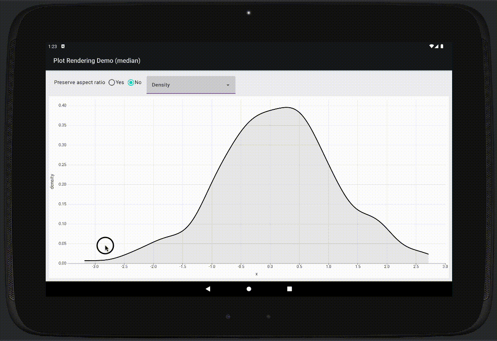

# lets-plot-skia-mapper

Rendering lets-plot with Skia. This project is a WIP.

### Local configuration for Lets-Plot project.
Skia mapper requires additional modules that have to be published. Checkout the `for-skiko-mapper` branch in `lets-plot` project directory and run the following command:
> ./gradlew publishAllPublicationsToMavenLocalRepository

### Local configuration for Skia mapper project.
Add the following property `maven.repo.local=<LETS-PLOT-PROJECT-ROOT>/.maven-publish-dev-repo` to the `local.properties` file.

### Android demo configuration.

With `SDK Manager` from menu "Tools -> Android -> SDK Manager" setup Android SDK. `local.properties` file should be automatically generated. Otherwise add it manually with proper path (like `sdk.dir=/Users/john/Library/Android/sdk`).  

With `Device Manager` from "Tools -> Android -> Device Manager" setup virtual device.   

Nexus 5 with Android 12 works well.

Select `demo-android-app` in `Run configurations` to run it.

### Compose demo

> OBSOLETE (?):
> 
> To run compose demo use gradle task `demo-compose-app -> Tasks -> compose desktop -> run`. 
> 
> Running the `main` function with gutter button is not working. To run another demo change the `compose.desktop.application.mainClass` property in the `demo-compose-app/build.gradle.kts`.

UPD:
Compose demos now seems to run just fine by clicking the gutter button or using context menu in the editor or the project tree.

### See also

[Compose-multiplatform iOS/Android Template](https://github.com/JetBrains/compose-multiplatform-ios-android-template)  
[Compose-multiplatform Versioning](https://github.com/JetBrains/compose-multiplatform/blob/master/VERSIONING.md)