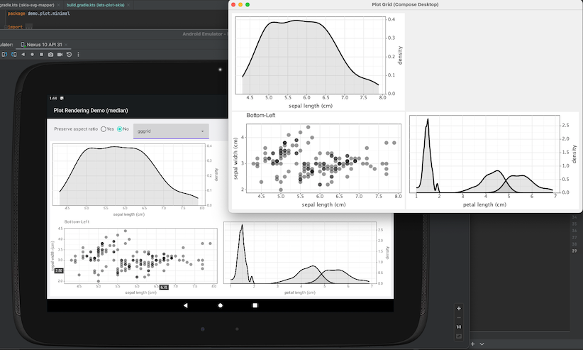

# Lets-Plot Compose Frontend

[](https://kotlinlang.org/docs/components-stability.html)
[](https://confluence.jetbrains.com/display/ALL/JetBrains+on+GitHub)
[](https://raw.githubusercontent.com/JetBrains/lets-plot-compose/master/LICENSE)
[](https://github.com/JetBrains/lets-plot-compose/releases/latest)

**Lets-Plot Compose Frontend** is a Kotlin Multiplatform library that allows you to embed \
[Lets-Plot](https://github.com/JetBrains/lets-plot) charts in a [Compose Multiplatform](https://github.com/JetBrains/compose-multiplatform) (Desktop, Android) application.

### Supported Targets

- **Desktop** (macOS, Windows, Linux)
- **Android** 

For more details see [Compose multiplatform compatibility and versioning overview](https://www.jetbrains.com/help/kotlin-multiplatform-dev/compose-compatibility-and-versioning.html).




## Dependencies

See release notes for the latest version of the dependencies: [v2.2.1](https://github.com/JetBrains/lets-plot-compose/blob/main/CHANGELOG.md#compatibility)

### Compose Multiplatform for Desktop

```kotlin
dependencies {
    // Lets-Plot Kotlin API
    implementation("org.jetbrains.lets-plot:lets-plot-kotlin-kernel:4.11.2")

    // Lets-Plot Multiplatform
    implementation("org.jetbrains.lets-plot:lets-plot-common:4.7.3")
    // Lets-Plot 'image export' (optional - enables exporting to raster formats)
    implementation("org.jetbrains.lets-plot:lets-plot-image-export:4.7.3")

    // Lets-Plot Compose UI
    implementation("org.jetbrains.lets-plot:lets-plot-compose:3.0.0")
}
```
See example: [Compose desktop](https://github.com/JetBrains/lets-plot-compose-demos/blob/main/compose-desktop/build.gradle.kts) demo.

### Compose Multiplatform for Android

```kotlin
dependencies {
    // Lets-Plot Kotlin API
    implementation("org.jetbrains.lets-plot:lets-plot-kotlin-kernel:4.11.2")

    // Lets-Plot Multiplatform
    implementation("org.jetbrains.lets-plot:lets-plot-common:4.7.3")
    // Lets-Plot Multiplatform Android-specific dependencies
    implementation("org.jetbrains.lets-plot:canvas:4.7.3")
    implementation("org.jetbrains.lets-plot:plot-raster:4.7.3")

    // Lets-Plot Compose UI
    implementation("org.jetbrains.lets-plot:lets-plot-compose:3.0.0")
}
```

See example: [Android minimal](https://github.com/JetBrains/lets-plot-compose-demos/blob/main/compose-android-min/build.gradle.kts) demo.


## Examples

You will find complete examples of using **Lets-Plot Kotlin API** with **Lets-Plot Compose Frontend** in the following\
GitHub repository: [JetBrains/lets-plot-compose-demos](https://github.com/JetBrains/lets-plot-compose-demos).

## Change Log

See [CHANGELOG.md](https://github.com/JetBrains/lets-plot-compose/blob/master/CHANGELOG.md).

## Code of Conduct

This project and the corresponding community are governed by the
[JetBrains Open Source and Community Code of Conduct](https://confluence.jetbrains.com/display/ALL/JetBrains+Open+Source+and+Community+Code+of+Conduct).
Please make sure you read it.

## License

Code and documentation released under
the [MIT license](https://github.com/JetBrains/lets-plot-compose/blob/master/LICENSE).
Copyright © 2023, JetBrains s.r.o.
